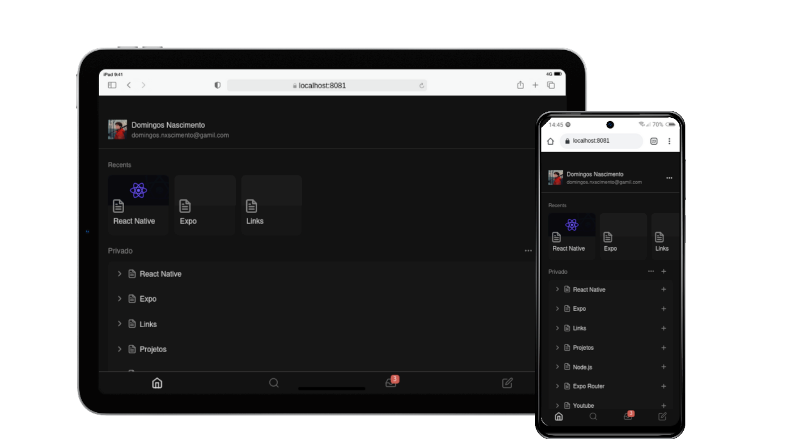

# 📱 rn-notion-ui - Notion Inspired Mobile UI

This project is a **React Native application** built with **Expo** and **expo-router**, inspired by the clean and modern design of **Notion**.  
The goal is to practice **mobile-first development**, explore **navigation patterns**, and deliver a polished **UI/UX** for study and portfolio purposes.

---

## 🚀 Technologies Used

- React Native  
- Expo  
- expo-router  
- TypeScript  
- @expo/vector-icons  

---

## 🎨 Highlights

- Tab navigation with custom icons (Feather)  
- Dark theme with reusable color palette  
- Badge notifications integrated into tab bar  
- Modular screen structure with expo-router  
- Clean and scalable UI components  

---

## 📦 Installation & Setup 

### Clone the repository 
```bash 
git clone https://github.com/Adyllsxn/rn-notion-ui.git cd rn-notion-ui
```

### Install dependencies
```bash 
npm install
```

### Run the project
```bash 
npx expo start
```

---

## 🌐 Access
- **Expo Go (Development):** Run `npx expo start` and scan QR code  

---

## 📸 Demo


---

## 👨‍💻 Author
**Domingos Nascimento (Adyllsxn)**  

- [LinkedIn](https://www.linkedin.com/in/adyllsxn/)  
- [GitHub](https://github.com/Adyllsxn)

---

## 📄 License

- This project is for educational and portfolio purposes only.
