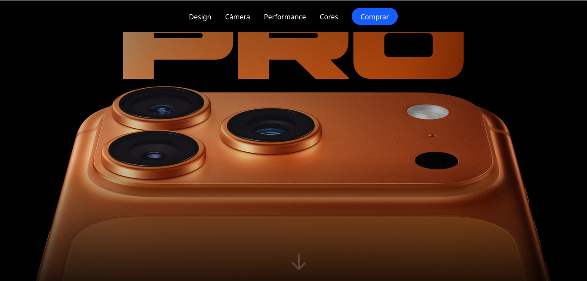

# 📱 iPhone 17 Inspired UI

This project is a **UI inspired** by the launch of the iPhone 17, built with **React** and **Tailwind CSS**.  
The goal is to practice **pixel-perfect design**, explore modern animations, and demonstrate mastery of **professional frontend development**.

---

## 🚀 Technologies Used

- React.js  
- Tailwind CSS  
- JavaScript  
- Vite  

---

## 🎨 Highlights

- Interface inspired by Apple's official iPhone 17 website  
- Responsive design for desktop and mobile  
- Centralized typography and color constants  
- Reusable components  
- Modern animations and smooth transitions  

---

## 🛠️ How to Run the Project

### 1. Clone this repository:
    ```bash
    git clone https://github.com/Adyllsxn/iphone17-inspired-ui.git
    ```
### 2. Navigate to the project folder:
    ```bash
    cd iphone17-inspired-ui
    ```
### 3. Install dependencies:
    ```bash
    npm install
    ```
### 4. Start the development server:
    ```bash
    npm run dev
    ```
### 5. Open in your browser:
    ```bash
    http://localhost:5173
    ```

## 📸 Demo


---

## 📌 Purpose

This project was created for practice and portfolio purposes. It has no commercial intent and is not affiliated with Apple. The aim is to showcase skills in modern frontend development and design inspired by major brands.

---

## 👨‍💻 Author
**Domingos Nascimento (Adyllsxn)**  

- [LinkedIn](https://www.linkedin.com/in/adyllsxn/)  
- [GitHub](https://github.com/Adyllsxn)
